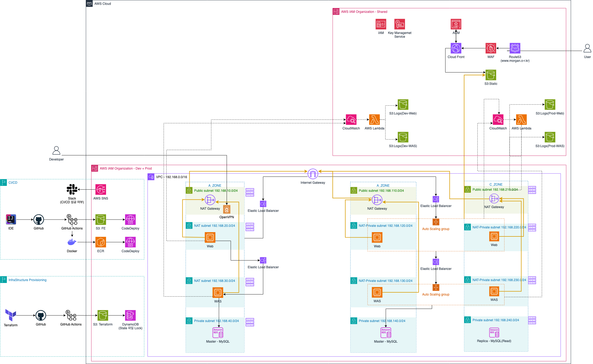

# Board_Infrastructure
게시판 프로젝트 - 인프라(Terraform) 레포지토리

## 아키텍처 구조도

## 주요 리소스 스펙
- VPC(`192.168.0.0/16`)
    - Internet Gateway X 1
    - Nat Gateway X 1
    - Subnet: Public(`192.168.10.0/24`), NAT(`192.168.20.0/24`, `192.168.30.0/24`), Private(`192.168.40.0/24`)

- EC2 인스턴스
    - 운영체제: **Linux**
    - `t3.medium(2vCPU, RAM 4GiB)` X 3

- RDS 인스턴스
    - RDBMS: **MySQL**
    - `t3.micro(2vCPU, RAM 1GiB)` X 1